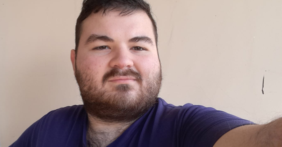

# Programación con objetos I
## Presentación Personal

### Sergio Gabriel La Grutta Vaccarini

Hola, Mi nombre es Sergio y empecé estudiando las tecnicaturas de Programación y Programación en videojuegos pero por unos cambios que se hicieron en las carreras actualemte estoy estudiando las Licenciaturas de estas carreras

Estoy en estas carreras por razones distitas.
- La carrera de Programación me puede abrir bastantes puertas laborales en el futuro

- Los videojuegos siempre me resultaron una bonita forma de alegrar a las personas sin importar sus gustos y quiero hacer eso

- En Github y en cualquier otro entorno virtual mi usuario es 3rrr0rp4nd4

- Mis generos de Videojuegos Favoritos son Roguelikes y Ritmicos